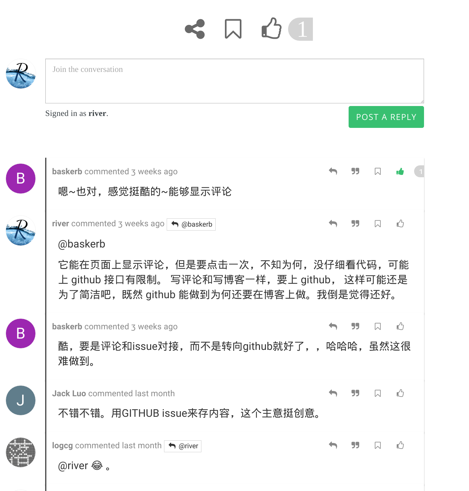
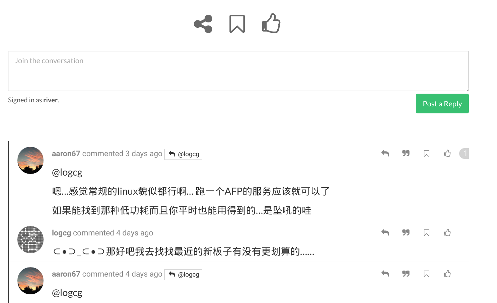

This plugin is a folk from [NodeBB Blog Comments](https://github.com/psychobunny/nodebb-plugin-blog-comments), I just added some more features and fixed some bugs to it.

* Support multiple blogs, use `articleID` and `blogger` to distinguish posts from different blogs, so this is kinda break change to the original nodebb-plugin-blog-comments.
* Simple script for ghost, hugo, pelican etc, and a general script for any other blogs, just add a `<script>` node at any place of the page, will support more blog platforms later.
* Use `siteTitle` instead of NodeBB in the `comments.tpl`.
* Support social sites sharing plugin and upvote and bookmark actions.
* Two css styles for comments.
* Fixed some bugs, like escaped title and content problems, profile image display, etc.

The multiple blogs feature is great, you can see at here: https://v2mm.tech/category/46/blog
There are already some blogs conntected with [V2MM](https://v2mm.tech).

# NodeBB Blog Comments

The original [NodeBB Blog Comments](https://github.com/psychobunny/nodebb-plugin-blog-comments) lets NodeBB act as a comments engine/widget for your blog. It supports both [Ghost](https://ghost.org/) and [WordPress](http://wordpress.org/).

The comments are exposed to any plugin you have built into the core, so it is completely possible to have emoticons, embedded video, and/or whatever else you want in the comments section of your blog.

Articles are published to a forum category of your choice, and will gain a tag that links it back to the original article.


## Screenshots

* Style 1


* Style 2



## Installation

First install the plugin:

    npm install nodebb-plugin-blog-comments2

Activate the plugin in the ACP and reboot NodeBB. Head over to the Blog Comments section in the ACP and select the Category ID you'd like to publish your blog content to (default is Category 1). Make sure you put the correct URL to your blog.

### General Use

Put this script to anywhere in your blog's article page, either in head or body, fill the variables, see explanations below.

```html
<script type="text/javascript">
$(document).ready(function() {
   var nbb = window.nbb = {};
   nbb.url = '//yournodebb.com'; // your forum url.
   nbb.cid = 79;   // the category where to publish.
   nbb.blogger = 'yourname';   // the name to distingush with different blog, omit it to fallback to 'default'.
   nbb.commentsCSS = nbb.url + '/plugins/nodebb-plugin-blog-comments2/css/comments2.css'; // which style you prefer, omit it to fallback to the default comments.css
   nbb.articleID = <Function to get the unique article id>   // To get the unique article id, see explations below.
   nbb.articleTitle = document.title;                       // To get the article title, document.title is the default.
   nbb.commentElement = document.getElementById('nodebb-comments');  // Where you put the comments widget, "nodebb-comments" element is the default.

   nbb.articleContent = <Function to get the excerpt of the article> // Write a function to get the post content.

   nbb.script = document.createElement('script');
   nbb.script.type = 'text/javascript';
   nbb.script.async = true;
   nbb.script.src = nbb.url + '/plugins/nodebb-plugin-blog-comments2/lib/general.js';  // load general.js async.
   (document.getElementsByTagName('head')[0] || document.getElementsByTagName('body')[0]).appendChild(nbb.script);
});
</script>
```

If you wish, you can create `<a id="nodebb-comments"></a>` to where you want to place the actual comments widget.

Also, there are some special scripts for some common blog platform. But in various blog themes, these scripts cannot guarantee to be true.
For example, `simple-wordpress.js` can't be used on any wordpress websites.
If you encounter any error, use `general.js` instead or put an issue to me.

### Ghost Installation

Paste this any where in `yourtheme/post.hbs`, somewhere between `{{#post}}` and `{{/post}}`. All you have to edit is line 3 (`nbb.url`) - put the URL to your NodeBB forum's home page here.

```html
<a id="nodebb-comments"></a>
<script type="text/javascript">
var nbb = {};
nbb.url = '//your.nodebb.com'; // EDIT THIS
nbb.cid = 1;	// OPTIONAL. Forces a Category ID in NodeBB.
nbb.blogger = 'blogger_name';	//  Omit it to fallback to 'default'.

(function() {
nbb.articleID = '{{../post.id}}';
nbb.tags = [{{#../post.tags}}"{{name}}",{{/../post.tags}}];
nbb.script = document.createElement('script'); nbb.script.type = 'text/javascript'; nbb.script.async = true;
nbb.script.src = nbb.url + '/plugins/nodebb-plugin-blog-comments2/lib/ghost.js';
(document.getElementsByTagName('head')[0] || document.getElementsByTagName('body')[0]).appendChild(nbb.script);
})();
</script>
<span id="nbb-title" style="display:none">{{../post.title}}</span>
<span id="nbb-markdown" style="display:none">{{../post.markdown}}</span>
<noscript>Please enable JavaScript to view comments</noscript>
```

If you wish, you can move `<a id="nodebb-comments"></a>` to where you want to place the actual comments widget.

See demo at [hgkat's blog](http://hgkat.com), her blog is using this script to connect with [V2MM](https://v2mm.tech).

### Simple Ghost Installation
Since some blogs might installed with docker, couldn't change the theme file, I create this simple script which can be added at any place of the html.

Just add this any where on your blog's page:

```
<script id='nodebb-comments-script' ourl="//your.nodebb.com" ocid="1" blogger='name' src="//your.nodebb.com/plugins/nodebb-plugin-blog-comments2/lib/simple-ghost.js"></script>
```
Note: ocid is the category id in your NodeBB, blogger is set for distinguish posts from different blogs.

See demo at [Wave's blog](http://blog.lovejog.com), his blog is using this script to connect with [V2MM](https://v2mm.tech).

### Simple Hugo Installation

```
<script id='nodebb-comments-script' ourl="//your.nodebb.com" ocid="1" blogger='name' src="//your.nodebb.com/plugins/nodebb-plugin-blog-comments2/lib/simple-hugo.js"></script>
```

See demo at [Leyafo's blog](http://www.leyafo.com/), his blog is using this script to connect with [V2MM](https://v2mm.tech).

### Simple Pelican Installation

```
<script id='nodebb-comments-script' ourl="//your.nodebb.com" ocid="1" blogger='name' src="//your.nodebb.com/plugins/nodebb-plugin-blog-comments2/lib/simple-pelican.js"></script>
```

See demo at [Cycleuser's blog](http://blog.cycleuser.org), his blog is using this script to connect with [V2MM](https://v2mm.tech).

**Wordpress plugin and any other plugins in PHP, I haven't test them yet, as I don't have those blogs.**
If your blog is wordpress, and would like to connect with [V2MM](https://v2mm.tech), I would be glad to set up this script for you.

### Wordpress Installation

First, install the [Wordpress JSON API](http://wordpress.org/plugins/json-api/) plugin.

Replace the contents of `/wp-content/themes/YOUR_THEME/comments.php` with the following (back-up the old comments.php, just in case):

```html
<?php
if ( post_password_required() )
	return;
?>

<a id="nodebb-comments"></a>
<script type="text/javascript">
var nodeBBURL = '//your.nodebb.com',
	wordpressURL = '<?php echo get_site_url(); ?>',
	articleID = '<?php echo the_ID(); ?>',
	blogger = 'name', //OPTIONAL. Assign an blogger name to disdinguish different blogger. Omit it to fallback to 'default'
	articleType = '<?php echo get_post_type() ?>',
	categoryID = -1; // If -1, will use category in NodeBB ACP.  Put in a category number to force that category.

(function() {
var nbb = document.createElement('script'); nbb.type = 'text/javascript'; nbb.async = true;
nbb.src = nodeBBURL + '/plugins/nodebb-plugin-blog-comments2/lib/wordpress.js';
(document.getElementsByTagName('head')[0] || document.getElementsByTagName('body')[0]).appendChild(nbb);
})();
</script>
<noscript>Please enable JavaScript to view comments</noscript>
```

### Comments Counter


You may optionally put a "# of comments" counter anywhere on the page with the following code:

```html
<span id="nodebb-comments-count"></span> Comments
```

A mechanism to query the number of comments on another separate page will be available in a future release.

### Author and Category information


To use NodeBB's category and author information (instead of using Ghost's user/tag system), there are two elements that this plugin searches for:

```html
Published by <span id="nodebb-comments-author"></span> in <span id="nodebb-comments-category"></span>
```

### Publishing

Head over to the article that you'd like to publish. The code will detect if you're both an administrator of your blog and NodeBB (so ensure that you're logged into both) and will display a publish button if so.

You may also create a `publishers` group in NodeBB to allow a group of regular users to have publish rights.
